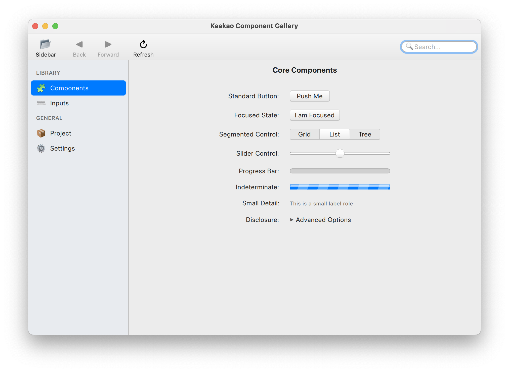
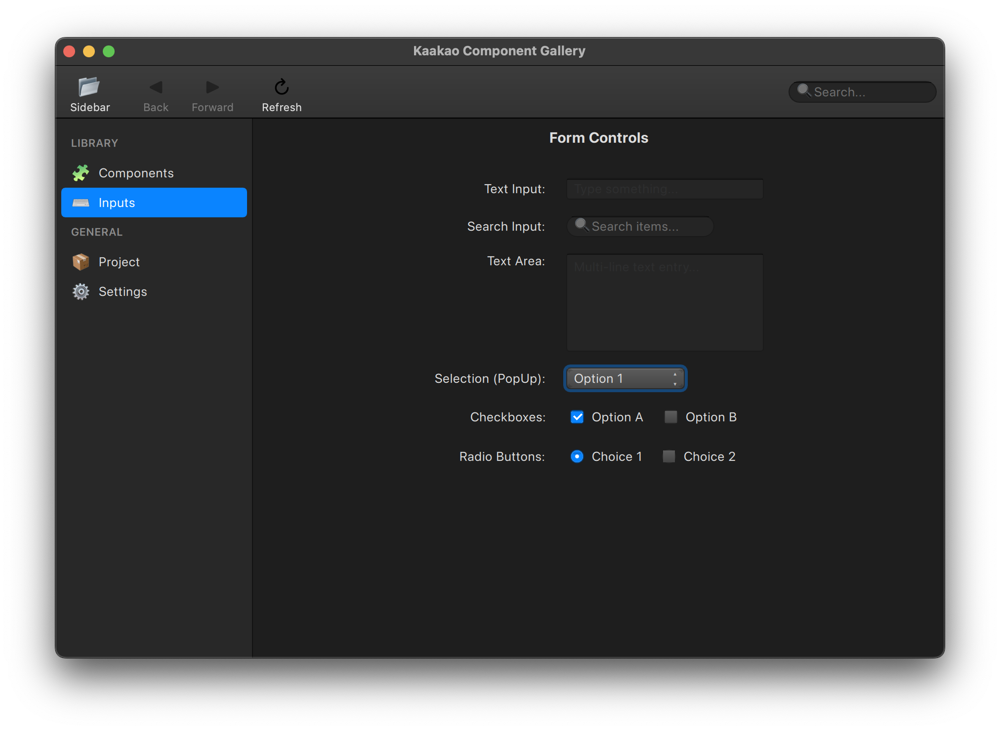

# Kaakao Components for Qt Quick

Kaakao is a QML component library for Qt 6 that implements the visual style of macOS from the OS X Yosemite to macOS Catalina eras. It provides a set of desktop-centric controls built on the `QtQuick.Controls.Basic` templates.

The project uses QML primitives and standard gradients to approximate the depth and lighting of the targeted macOS design language without external image assets.




---

## Features

- **Design Target:** Late-classical macOS (Yosemite through Catalina).
- **Theming:** Reactive support for Light and Dark color schemes.
- **Implementation:** Built using `QtQuick.Controls.Basic` to maintain standard accessibility and focus logic.
- **Dependencies:** Requires Qt 6 and the `Qt5Compat.GraphicalEffects` module for gradients and masking.
- **Testing:** Includes a suite of `QtTest` cases for each component and theme state.

## Components

- **Windows & Navigation:** `KaakaoWindow`, `KaakaoSidebar`, `KaakaoToolBar`, `KaakaoToolButton`.
- **Inputs:** `KaakaoButton`, `KaakaoTextField`, `KaakaoSearchField`, `KaakaoTextArea`, `KaakaoComboBox`, `KaakaoSegmentedControl`.
- **Indicators:** `KaakaoProgressBar`, `KaakaoSlider`, `KaakaoDisclosureTriangle`.
- **General:** `KaakaoLabel`, `KaakaoDialog`, `KaakaoFocusRing`.

---

## Build and Execution

### Prerequisites

- Qt 6.5 or newer
- CMake 3.16 or newer

### Building the Gallery

```bash
mkdir build && cd build
cmake ..
make
./gallery/KaakaoGallery
```

### Running Tests

```bash
cd build
ctest --output-on-failure
```

---

## Usage

```qml
import QtQuick
import Kaakao

KaakaoWindow {
    width: 400
    height: 300
    title: "Kaakao Application"

    Column {
        anchors.centerIn: parent
        spacing: 20

        KaakaoLabel {
            text: "Heading Text"
            role: KaakaoLabel.Role.Header
        }

        KaakaoButton {
            text: "Action Button"
            onClicked: console.log("Action triggered")
        }
    }
}
```

---

## License

This project is licensed under the BSD 3-Clause License. See the [LICENSE](LICENSE) file for details.
